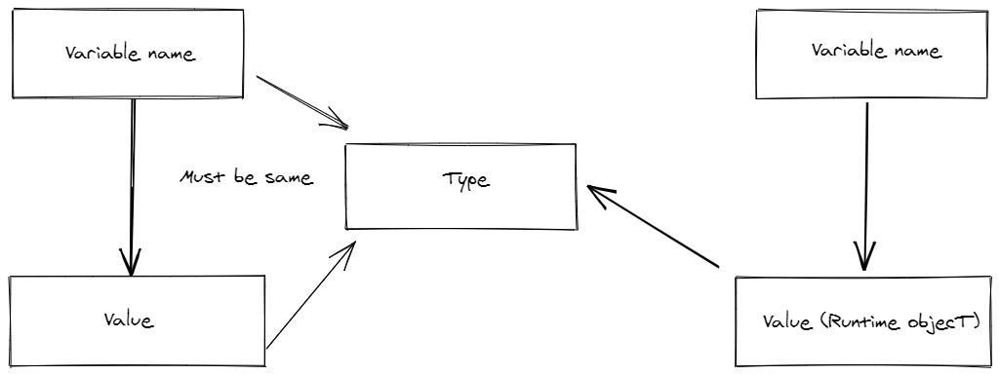
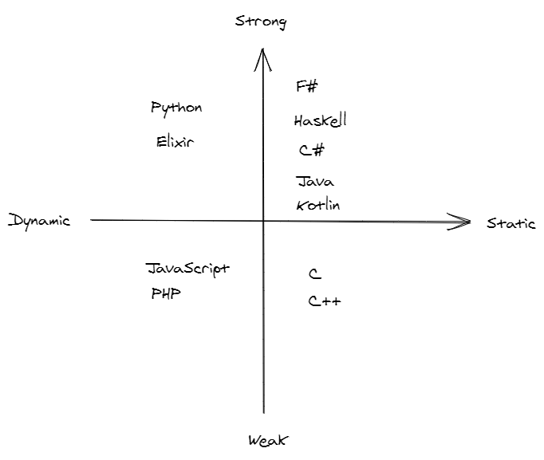

<!-- theme: default -->

# Type system in programming languages
An introduction

-------

# Definition
* A logical system that consists of set of rules that assigns a **property (type)** to variables, expression or functions.
* Main purpose is to reduce bugs
* Other purposes include abstraction, business rules, compiler optimizations or documentation
-------

# Type safety and checking
* The extent a programming language discourages or prevents type errors.
* A type error is undesired program behaviour that might occur due to incompatible data types of variables or functions. 
* Verify and enforce contraints of a type either at **compile time** (static) or at **runtime** (dynamic), or a combination of both

-------

# Statically typed languages
* Static type checker
* Analyze source code at compile time
* Type of variable or method is known at compile time
    * Explicitly or by use of type inference
* A variable declared of a type, cannot be assigned a value of a different type (without casting)
* Some language features cannot be checked statically (i.e downcasting)
* Catch bugs early
* More optimized code, better perf.
* Examples: C, C++, Java, C#, Haskell, F#, Elm, OCaml, Kotlin, Scala, Rust, TypeScript
---------

# Dynamically typed languages
* Dynamic type checker (but no static type checker)
* Type check at run time
* Type is associated with run-time objects, the variable has no type
    * Type tag containing type information called, **RTTI**
    * RTTI is alos used for downcasting, reflection and other similar features
* Scripting languages
* No compilation, interpreted languages
* Might result in less optimized code
* Quicker/faster build or debug
* Examples: Python, JavaScript, PHP
-------

# Static vs dynamic typing


-------

# Static vs dynamic typing 
Which ones are valid?
```csharp
//C# - explicit type
int age = 15;
age = "Old";

//C# Type inference
var amount = 500;
amount = "Bouvet"; 

//Python
salary = 500;
salary = "Bouvet";
```
-------

# Strongly typed and weakly typed languages 
* How strict the types are enforced
* Rule of thumb: The more *strict* the compiler/interpreter is, the more *strongly typed* a language is
* Strongly typed:
    * No implicit conversion between types
    * Python, C#, F#, Haskell, Java
* Weakly typed:
    * Conversion between types
    * C, C++, PHP, JavaScript

-------

# Strongly and weakly typed languages
Which ones are valid?
```csharp
    //C#
    var age = 26;
    var gender = "M";
    var result = age + gender; 
```    
```fsharp
    //F#
    let age = 26
    let gender = "M"
    let result = age + gender
```

```python
    #Python
    age = 26
    gender = "M"
    result = age + gender
```
-----
# Strongly and weakly typed languages
Which ones are valid?
```javascript
    //JS;
    const age = 26;
    const gender = "M";
    const result = age + gender;

    //JS;
    const age = 26;
    const genders = ["M","F","Other"];
    const result = age + genders;
```
-----

## Overview


-------
# Nominal and structural type system
* Nominal:
    * Uses the name to determine equality and subtypes
    * Java, F#, Rust, C#
* Structural
    * Uses the structure to determine equality
    * OCaml, TypeScript, Haskell

-------

```fsharp
//F# Nominal
type Employee = {
    Name: string   
}

type Manager ={
    Name: string;
}

let manager: Manager = {Name= "Ivar"}
let employee: Employee = {Name= "Terje"}

let names (employee:Employee) (manager:Employee) = 
    employee.Name + manager.Name

names employee manager |> ignore //Problem
```
------

# Nominal and structural type systems
```typescript
//TypeScript structural

type Employee = {
    name: string   
}

type Manager ={
    name: string;
}

const names = (employee: Employee, manager: Employee) => {
    return employee.name + manager.name
}

let manager: Manager = { name: "Ivar" };
let employee: Employee = { name: "Terje" };
names(employee, manager) // OK
```
-------

# That`s it

https://github.com/terjebra/type-systems
